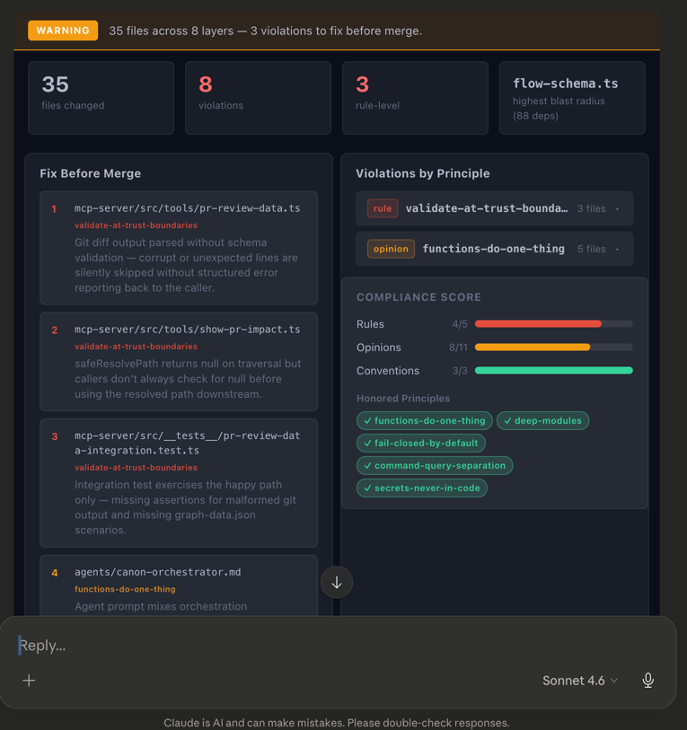
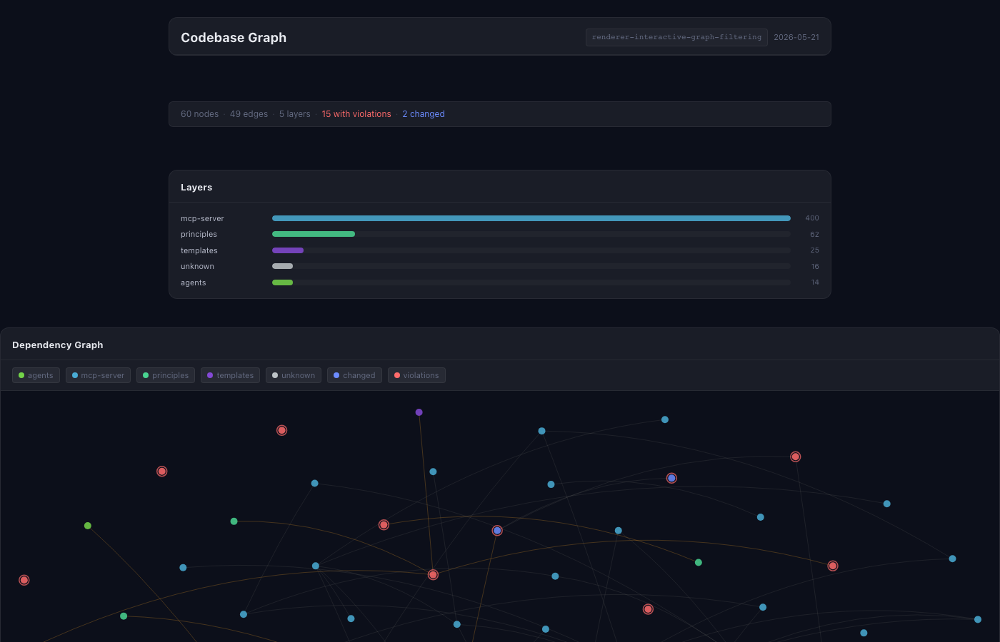
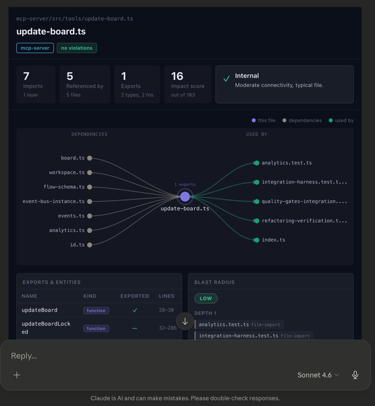

# Canon

Imagine asking an AI coding tool to "rebuild the notification system" and having it — without any flags or configuration — spin up parallel research agents, synthesize their findings, convene three competing architects who each design from a different angle, let you review the merged design before a line of code is written, break implementation across parallel worktrees with between-wave security scans, and ship through a principle-checked review. All enforced by your own rules, loaded automatically per file.

That's what Canon does.

---

## What Canon Is

Canon is a Claude Code plugin that turns Claude into an orchestrated, multi-agent build system. You describe what you want. Canon classifies your intent, selects the right workflow, and drives specialist agents through research, design, implementation, testing, and review — coordinating their work, surfacing decisions, and enforcing your engineering principles throughout. From your side: you just talk to Claude.

Canon has strong opinions about software engineering and is designed to share them with every agent it spawns. Principles aren't decoration; they're loaded into agents per task, enforced during implementation, and drift-tracked across sessions. When the codebase diverges from your standards, Canon tells you.

---

## Why Canon

### Competing agents, not one shot

For design-heavy tasks, Canon runs multiple architect agents in parallel with different optimization lenses — one prioritizing performance, one simplicity, one extensibility — then synthesizes their outputs into a unified design. You see all three angles; you get the best of each.

```yaml
# epic.md — design state
compete:
  count: 3
  strategy: synthesize
  lenses: [performance, simplicity, extensibility]
```

The synthesizer doesn't pick a winner; it builds something better than any individual input by attributing each major decision to the approach that inspired it. If two inputs are genuinely incompatible on a choice, the synthesizer picks and explains the tradeoff. Source: [`mcp-server/src/features/orchestration/engine/compete.ts`](./mcp-server/src/features/orchestration/engine/compete.ts)

### Structured debate with convergence checking

For especially contested design questions, Canon's debate protocol convenes multi-team structured deliberation. Teams state positions (round 1), challenge each other (round 2), respond and revise (round 3), then narrow to unresolved disagreements until convergence — or until the user steps in at a HITL checkpoint.

Convergence is detected heuristically: Canon reads the latest round's messages and checks for convergence language, short messages (teams running out of arguments), or explicit consensus signals. If two-thirds of teams are signaling agreement, the debate closes and hands off to the synthesizer.

```yaml
# epic.md — debate config
debate:
  teams: 3
  composition: [researcher, architect]
  min_rounds: 2
  max_rounds: 5
  convergence_check_after: 3
  hitl_checkpoint: true
```

Source: [`mcp-server/src/features/orchestration/engine/debate.ts`](./mcp-server/src/features/orchestration/engine/debate.ts)

### Adaptive wave planning

For large changes, Canon doesn't plan everything upfront and execute blindly. The architect plans wave by wave: implement wave 1, see the results, plan wave 2 with what was actually learned. Between waves, Canon runs automatic consultations:

- **Plan review** — an architect reads the upcoming wave's plans for conflicts, ambiguity, and pre-answerable questions before implementors start
- **Pattern check** — flags architectural drift from the design intent
- **Early security scan** — flags secrets, injection risks, and insecure defaults in wave changes before the next wave builds on them
- **Targeted research** — digs into open questions surfaced by pattern check

These consultations run as background agents and inject their findings directly into the next wave's implementor prompts. Implementors get the right context without asking for it. Source: [`flows/epic.md`](./flows/epic.md), [`flows/fragments/`](./flows/fragments/)

### Knowledge graph with affinity injection

Canon builds a SQLite-backed knowledge graph of your codebase: import/export relationships, function calls, inheritance, cycle detection, hub identification, and architectural layer assignments. When an agent is about to touch a file, Canon queries the graph and injects relevant context — callers, callees, blast radius, layer violations — into the agent's prompt automatically.

This is file context affinity injection: agents get the *right* files and relationships, not a random context dump. You can also query the graph directly:

```
"What breaks if I change the User model?"
"Show me the codebase graph"
"Show me the context for src/routes/orders.ts"
```

The graph also tracks hotspot scores (churn × complexity) and co-change pairs (files that always change together) via a git intelligence pipeline. Source: [`mcp-server/src/features/knowledge-graph/`](./mcp-server/src/features/knowledge-graph/)

### Principles with drift detection

Canon ships 56 built-in engineering principles across three severity tiers. Every agent loads the principles relevant to its task — matched by architectural layer and file path pattern. Reviewers check compliance. Drift reports show you which principles the codebase is drifting away from, with trend data, most-violated principle lists, and hotspot directories.

Principles aren't static documentation. `/canon:learn` analyzes accumulated review data to suggest severity adjustments (a convention with consistent violations might warrant promoting to a strong-opinion), flag stale principles the codebase no longer follows, and surface candidates for new principles based on recurring review findings. Source: [`mcp-server/src/features/principles/`](./mcp-server/src/features/principles/), [`mcp-server/src/features/diagnostics/tools/get-drift-report.ts`](./mcp-server/src/features/diagnostics/tools/get-drift-report.ts)

### PR review with impact analysis

The `show_pr_impact` tool doesn't just diff files in isolation. Before a review runs, it shows a **change story**: files clustered into logical groups (new feature, removal, layer group, prefix group) with a narrative summary of what changed. After a Canon review, it shows verdict, compliance score, fix-before-merge checklist, blast radius chart, and violations by principle — all in a progressive interactive dashboard.

The blast radius calculation uses the knowledge graph to surface which files are affected by the diff's changes, even if they aren't in the diff themselves. Co-change warnings flag files that historically always change together when you've only changed one of them. Source: [`mcp-server/src/features/pr-review/`](./mcp-server/src/features/pr-review/)

### HITL breakpoints — you're never out of the loop

Flows pause at key moments for your input. After design (before code is written), you see a checkpoint summary: what's planned, what decisions were made, what tradeoffs are on the table. You can approve, ask for revisions, or redirect. Canon never writes code without your sign-off on the design.

The checkpoint agent uses semantic classification, not keyword matching. "Sounds good" routes to `approved`. "Wouldn't Postgres make more sense?" routes to `revise`. The user's feedback is saved to `REVISION-NOTES.md` and the architect re-works the plan. Source: [`flows/fragments/user-checkpoint.md`](./flows/fragments/user-checkpoint.md)

---

## How It Works

### Intent classification and invisible dispatch

Every message runs through the orchestrator, which classifies your intent and picks the right flow automatically. No flags, no "which mode do you want?". "The search is broken" becomes a fast-path fix. "Rebuild the notification system" becomes an epic flow. "How does the auth system work?" becomes an explore flow with parallel research agents.

If you want to steer: "skip research", "just plan, don't implement", "use a quick fix" all work as natural instructions.

### Flows and state machines

A flow is a YAML-defined state machine. Each state names an agent to spawn and transitions to other states. The orchestrator walks the graph by calling `load_flow` → `init_workspace` → repeated `drive_flow` calls.

| Flow | Tier | When Canon picks it |
|------|------|---------------------|
| `fast-path` | Small | Bug fix, small change, 1–3 files |
| `feature` | Medium | New feature, 4–10 files |
| `refactor` | Medium | Behavior-preserving restructuring |
| `migrate` | Medium | Dependency migration, "move to X" |
| `epic` | Large | Cross-cutting change, 10+ files; uses adaptive waves |
| `explore` | Research | "How does X work?" — no code changes |
| `test-gap` | Testing | Analyze coverage gaps, write tests |
| `review-only` | Review | Review a PR or branch |
| `security-audit` | Security | Dedicated security audit |
| `adopt` | Adoption | Scan for violations and auto-fix (invoked by `init`) |

### Flow fragments — composable state groups

Flows are assembled from reusable state groups called fragments. A fragment declares states, transitions, and typed parameters; a flow includes it and provides values.

```yaml
# How epic.md includes user-checkpoint
includes:
  - fragment: user-checkpoint
    with:
      after_approved: implement
      on_revise: design

  - fragment: review-fix-loop
    with:
      after_clean: pre-launch-check
    overrides:
      review:
        large_diff_threshold: 500
```

A flow can also override specific properties of an included fragment's states — changing a threshold, timeout, or transition — without forking the fragment. This lets flows share behavior while customizing for their tier. Source: [`flows/fragments/`](./flows/fragments/)

### Worktree isolation

Each agent runs in its own git worktree — a lightweight separate working directory on your branch. This enables safe parallelism (multiple implementors working simultaneously without touching each other's files) and keeps the main worktree clean throughout. Wave tasks each get their own worktree; Canon manages the lifecycle and merges results.

### Resume semantics

Workspaces persist. If a build is interrupted — connection dropped, session ended, context limit hit — `board.json` has the full state. Picking up where you left off is "resume" intent; Canon reads the board and re-enters the state machine at the interrupted step.

### Hooks

Canon installs tool-use interceptors that run automatically. These are guardrails that enforce policy without requiring agent compliance:

| Hook | Trigger | Purpose |
|------|---------|---------|
| `pre-commit-check.sh` | Before `git commit` | Detect secrets, validate principle compliance |
| `destructive-guard.sh` | Before Bash | Block force push, hard reset, and other dangerous git ops |
| `workspace-lock-guard.sh` | Before Bash | Prevent concurrent builds on the same branch |
| `pre-push-review.sh` | Before `git push` | Require review before pushing |
| `large-file-guard.sh` | Before Write/Edit | Prevent accidental large file commits |
| `principle-inject.sh` | Before Write/Edit | Inject relevant principle summaries into prompts |
| `learn-nudge.sh` | After Bash | Suggest principle creation or updates |
| `compaction-check.sh` | After Bash | Detect workspace file growth |

Source: [`hooks/hooks.json`](./hooks/hooks.json)

---

## A Walkthrough

You type: **"add dark mode to the dashboard"**

**Classification.** Canon reads this as a build intent — medium scope, UI work. It picks the `feature` flow.

**Research.** A `researcher` agent scans the codebase: finds the theming system, identifies the files that would change (Tailwind config, component tokens, top-level layout), flags that the user preference isn't currently persisted. Saves structured findings to the workspace.

**Design.** A `architect` agent reads the research, produces a design: CSS custom properties for tokens, `prefers-color-scheme` media query as default, localStorage for persistence, a theme context in React. It writes an `INDEX.md` with task plans for each implementor.

**Checkpoint.** The guide agent summarizes the design in plain language and asks for your thoughts. You say "looks good but also support system preference". The feedback is saved; the architect revises. You approve.

**Implement.** Two `implementor` agents work in parallel worktrees — one on the theming system, one on the component updates. Before they start, a plan-review consultation fires: an architect reads both plans and injects a note that the token naming scheme needs to be consistent across both tasks. Implementors get that note in their prompts. After wave 1, an early security scan checks for any accidental secrets or injection issues.

**Test.** A `tester` agent runs the test suite, analyzes coverage gaps, and writes missing tests for the theme context and toggle behavior.

**Review.** A `reviewer` agent runs a principle-based review. It loads principles scoped to the `ui` layer — `no-inline-styles`, `accessible-color-contrast`, `prefer-system-defaults` — checks compliance, and scores the change. Verdict: clean. One advisory note on color contrast that gets logged to drift history.

**Ship.** `shipper` merges the worktrees, runs a final gate check, creates the PR.

Total time from your message to ready-for-merge: Canon drove all of it. You made one decision.

---

## Agent Roster

Each state in a flow spawns a specialist agent. Agents receive structured context: relevant principles for their task, workspace artifacts from prior states, and affinity-injected file context from the knowledge graph.

| Agent | Role |
|-------|------|
| Researcher | Codebase analysis, risk assessment, investigation |
| Architect | Design decisions, task plans, technical direction |
| Implementor | Code changes, tests, self-review |
| Tester | Test coverage analysis, test writing, verification |
| Reviewer | Principle-based code review, compliance scoring |
| Security | Vulnerability assessment, threat modeling |
| Fixer | Targeted fixes for failing tests or review violations |
| Scribe | Context sync — updates CLAUDE.md and documentation |
| Shipper | Merge, PR creation, deployment prep |
| Chat | Design discussions, brainstorming, ideas |
| Guide | Questions, status checks, HITL checkpoints |
| Writer | Principle authoring and editing |
| Learner | Review data analysis, principle improvement suggestions |

---

## Principles

Principles are the core of Canon. They are markdown files with YAML frontmatter that tell agents what rules, preferences, and conventions to apply. Canon ships with 56 built-in principles (5 rules, 34 strong-opinions, 17 conventions) covering security, architecture, testing, and code design. Your active principles live in `.canon/principles/` after init.

```yaml
---
id: validate-at-trust-boundaries
title: Validate at Trust Boundaries
severity: rule
scope:
  layers: [api]
  file_patterns: ["src/routes/**", "**/*.controller.ts"]
tags: [security, validation]
---

All external input must be validated at trust boundaries — API routes, webhook
handlers, queue consumers. Reject invalid input early; never pass unvalidated
data deeper into the system.
```

### Severity levels

| Severity | Meaning |
|----------|---------|
| `rule` | Hard constraint. Violations block merges. |
| `strong-opinion` | Default path. Deviations require justification. |
| `convention` | Stylistic preference. Tracked for drift, doesn't block. |

Principles are matched by architectural layer and file path pattern. When you touch `src/routes/orders.ts`, Canon loads principles scoped to the `api` layer — plus any that match the file path — rules first, then strong-opinions, then conventions. Project-local principles override any built-in principle with the same `id`.

---

## Slash Commands

| Command | What it does |
|---------|-------------|
| `/canon:init` | Set up Canon in your project — copies starter principles, auto-detects conventions, generates CLAUDE.md, runs adoption scan |
| `/canon:check` | Lightweight pre-commit principle compliance check |
| `/canon:pr-review` | Review a PR or branch against principles |
| `/canon:edit-principle` | Edit a principle — severity, scope, tags, or body |
| `/canon:test-principle` | Verify a principle fires by generating a violation |
| `/canon:learn` | Analyze review data and suggest principle improvements |
| `/canon:doctor` | Diagnose setup issues — broken frontmatter, MCP server health |
| `/canon:clean` | Clean up workspace artifacts; optionally archive to project history |

---

## The MCP Server

Canon's tooling is provided by a TypeScript MCP server (`mcp-server/`) that Claude Code connects to automatically when the plugin is installed. It exposes approximately 40 tools across six areas:

| Area | Tools |
|------|-------|
| **Orchestration** | `load_flow`, `init_workspace`, `drive_flow`, `update_board`, `report_result`, `post_message`, `get_messages`, `inject_wave_event`, `get_transcript`, `seed_workspace`, `simulate_flow`, `resolve_wave_event`, `resolve_after_consultations` |
| **Principles** | `get_principles`, `list_principles`, `get_compliance`, `review_code` |
| **Knowledge graph** | `codebase_graph`, `graph_query`, `semantic_search`, `store_summaries` |
| **PR review** | `show_pr_impact`, `review_code`, `store_pr_review` |
| **File context** | `get_file_context` |
| **Diagnostics** | `get_drift_report`, `record_agent_metrics`, `categorize_failures`, `get_history` |

Tools that produce visual outputs open as interactive MCP App dashboards in Claude Desktop and compatible clients. In terminal-only environments, they return equivalent structured text.

### MCP App dashboards (Svelte UI)

Canon includes a Svelte-based UI served by the MCP server, rendered as embedded apps in Claude Desktop.

**PR Review** — Progressive view. Before a review runs: change story (files clustered by logical group), narrative summary, impact tabs. After a Canon review: verdict, compliance score, fix-before-merge checklist, violations by principle, blast radius chart, layer distribution. Click any violation to ask Claude to explain and fix it.



**Codebase Graph** — Interactive dependency graph built from your source files. Nodes colored by architectural layer, highlighted for violations or diff membership. Filter by layer, violations, or changed files. Built on Sigma.js.



**File Context** — Deep-dive on a single file: layer, dependencies, exports, blast radius, principle violations, hotspot score, co-change partners.



Source: [`mcp-server/src/ui/`](./mcp-server/src/ui/)

---

## Feature Index

| Feature | What it does | Source |
|---------|-------------|--------|
| Competing agents | Multiple agents race with different optimization lenses; synthesizer merges the best ideas | [`engine/compete.ts`](./mcp-server/src/features/orchestration/engine/compete.ts) |
| Debate protocol | Multi-team structured deliberation with heuristic convergence detection and HITL checkpoint | [`engine/debate.ts`](./mcp-server/src/features/orchestration/engine/debate.ts) |
| Adaptive waves | Architect re-plans after each implementation wave; consultations fire between waves | [`flows/epic.md`](./flows/epic.md) |
| Wave consultations | Plan review, pattern check, early security scan, targeted research inject into implementor prompts | [`flows/fragments/`](./flows/fragments/) |
| Knowledge graph | SQLite-backed codebase graph with affinity injection, semantic search, cycle detection, hub identification | [`features/knowledge-graph/`](./mcp-server/src/features/knowledge-graph/) |
| Git intelligence | Hotspot scoring (churn × complexity) and co-change pair detection from git history | [`features/knowledge-graph/git-intel/`](./mcp-server/src/features/knowledge-graph/git-intel/) |
| Principle enforcement | Principles loaded per task, enforced by reviewer, drift-tracked across sessions | [`features/principles/`](./mcp-server/src/features/principles/) |
| Drift detection | Compliance rate trends, most-violated principles, hotspot directories, `/canon:learn` suggestions | [`features/diagnostics/`](./mcp-server/src/features/diagnostics/) |
| PR impact analysis | Change story clustering, blast radius, co-change warnings, progressive review dashboard | [`features/pr-review/`](./mcp-server/src/features/pr-review/) |
| HITL breakpoints | Flows pause for user approval; semantic classification routes to approved/revise/reject | [`flows/fragments/user-checkpoint.md`](./flows/fragments/user-checkpoint.md) |
| Worktree isolation | Each agent in its own git worktree; safe parallelism, clean main worktree | [`hooks/`](./hooks/) |
| Hooks system | Pre/post tool-use interceptors enforcing secrets detection, destructive-op guard, principle injection | [`hooks/hooks.json`](./hooks/hooks.json) |
| Flow fragments | Reusable state groups with typed params and per-flow overrides | [`flows/fragments/`](./flows/fragments/) |
| Intent classification | Auto-detect flow from natural language; no flags or configuration needed | [`skills/canon/`](./skills/canon/) |
| Resume semantics | Interrupted flows resume from `board.json`; workspaces persist across sessions | [`mcp-server/src/domains/workspaces/`](./mcp-server/src/domains/workspaces/) |
| Agent metrics | Tool calls, orientation calls, and turns tracked per agent for efficiency analysis | [`features/diagnostics/tools/record-agent-metrics.ts`](./mcp-server/src/features/diagnostics/tools/record-agent-metrics.ts) |
| Conventions auto-detection | `/canon:init` scans your codebase and generates `CONVENTIONS.md` and `CLAUDE.md` from detected patterns | [`skills/canon/commands/init.md`](./skills/canon/commands/init.md) |
| Svelte UI | Interactive dashboards for PR review, codebase graph, and file context via MCP App protocol | [`mcp-server/src/ui/`](./mcp-server/src/ui/) |
| Adoption scan | Scans existing codebases for principle violations and produces tiered remediation report | [`flows/adopt.md`](./flows/adopt.md) |
| Postcondition contracts | States declare file-exists / pattern-match / bash-check assertions verified after completion | [`engine/contract-checker.ts`](./mcp-server/src/features/orchestration/services/contract-checker.ts) |
| File claim tracking | Workflows register file ownership; overlapping claims produce advisory warnings | [`shared/lib/file-claims.ts`](./mcp-server/src/shared/lib/file-claims.ts) |
| Agent provenance | Commit messages include structured trailers: `Canon-Workflow`, `Canon-Agent`, `Canon-State`, `Canon-Task` | [`shared/lib/commit-trailers.ts`](./mcp-server/src/shared/lib/commit-trailers.ts) |

---

## Installation

Canon is a [Claude Code plugin](https://docs.anthropic.com/en/docs/claude-code/plugins). Install it from GitHub:

```bash
# Add the marketplace source
/plugin marketplace add micherra/canon

# Install the plugin
/plugin install canon@micherra-canon
```

Or install from a local clone:

```bash
git clone https://github.com/micherra/canon.git
/plugin marketplace add ./canon
/plugin install canon@canon
```

### Requirements

- [Claude Code](https://docs.anthropic.com/en/docs/claude-code) CLI

### Initialization

Run this once inside your project:

```bash
/canon:init
```

Canon will:
- Copy 56 built-in principles into `.canon/principles/`
- Scan your codebase to auto-detect conventions and generate `.canon/CONVENTIONS.md`
- Generate or update `CLAUDE.md` with Canon orchestration instructions
- Run an adoption scan for existing principle violations (pass `--no-scan` to skip)

---

## Configuration

All configuration is in `.canon/config.json`. Every key is optional.

```json
{
  "layers": {
    "api": ["api/**", "routes/**", "controllers/**"],
    "ui": ["app/**", "components/**", "pages/**", "views/**"],
    "domain": ["services/**", "domain/**", "models/**"],
    "data": ["db/**", "data/**", "repositories/**"],
    "infra": ["infra/**", "deploy/**"],
    "shared": ["utils/**", "lib/**", "shared/**", "types/**"]
  }
}
```

Override `layers` to match your project's directory structure. Run `/canon:doctor` to check for configuration issues.

---

## Data and Privacy

Everything Canon stores lives in `.canon/` in your project root:

| Path | Purpose |
|------|---------|
| `principles/` | Your project's active principles |
| `CONVENTIONS.md` | Project conventions for implementors |
| `config.json` | Configuration |
| `knowledge-graph.db` | SQLite knowledge graph (file dependencies, entities, metrics, hotspots, co-change pairs) |
| `orchestration.db` | SQLite execution state for active build pipelines |
| `drift.db` | SQLite drift tracking (review results, compliance history) |
| `workspaces/{branch}/{slug}/` | Per-task build state (board.json, session.json, progress.md, plans/, reviews/) |

Canon does not collect, transmit, or share any data. No telemetry, no analytics, no background network calls. Everything stays local.

---

## Project Layout

```
canon/
├── agents/               # Specialist agent definitions (markdown + YAML frontmatter)
├── flows/                # Flow state machine definitions
│   └── fragments/        # Reusable state groups included by flows
├── hooks/                # Pre/post tool-use interceptor scripts (hooks.json + shell scripts)
├── mcp-server/           # TypeScript MCP server — Canon harness tools + principle/graph/drift tools
│   └── src/
│       ├── app/          # Entry point (index.ts), tool registration
│       ├── domains/      # Shared domain types (flows, workspaces, messages, board)
│       ├── features/     # Tool implementations grouped by feature area
│       ├── platform/     # Job manager, infrastructure
│       └── ui/           # Svelte frontend — MCP App dashboards
├── principles/           # Built-in principles (56 total: 5 rules, 34 strong-opinions, 17 conventions)
├── rules/                # Agent-behavior rules (loaded per agent at runtime)
├── primers/              # Domain primers (backend-api, frontend, testing, …) — agent reasoning context
├── references/           # Orchestrator + protocol fragments (canon-orchestrator.md, principle-format.md, …)
├── skills/canon/         # Claude Code skill definition — entry point for Canon activation
│   ├── commands/         # Slash command definitions
│   └── evals/            # Eval suite
├── templates/            # Artifact templates agents must follow
└── .canon/               # Runtime data (workspaces, principles, config, SQLite DBs)
    └── workspaces/       # Per-branch/task build state
```

---

## Reference

Full MCP tool signatures, flow schema, hook details, and the principles guide: [docs/reference/canon-reference.md](./docs/reference/canon-reference.md).

What's coming next: [docs/roadmap.md](./docs/roadmap.md).
