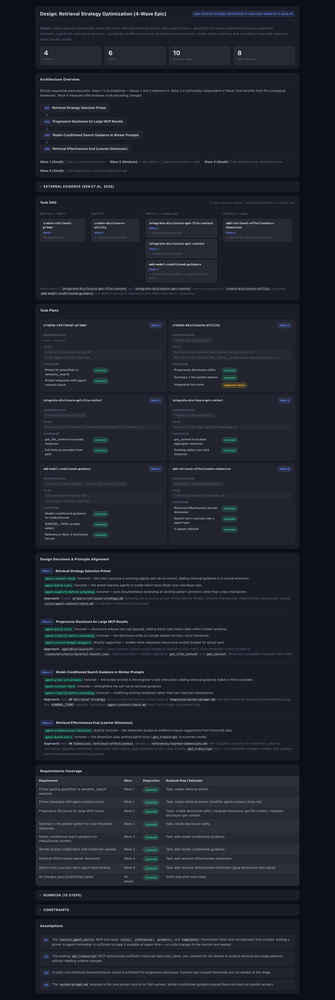
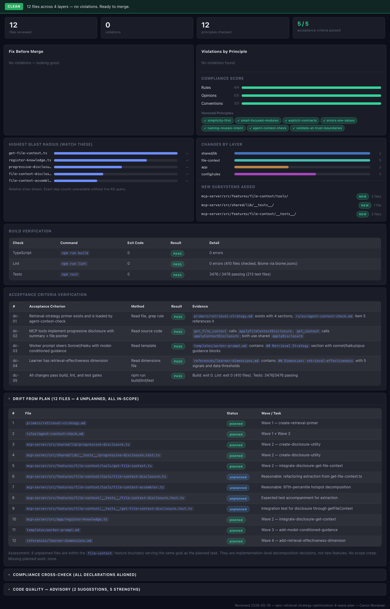

# Canon

Install Canon and Claude gains something it doesn't have by default: systematic engineering judgment. Principles loaded per task. A knowledge graph of your codebase. Coordinated multi-agent builds with interactive review dashboards. And a disciplined habit of asking you to approve the plan before writing a single line of code.

That's what Canon does — it makes Claude a principled engineering partner.

---

## What Canon Is

Canon is a [Claude Code plugin](https://docs.anthropic.com/en/docs/claude-code/plugins). Once installed, Claude understands your codebase structure, enforces your engineering principles in every build, and surfaces decisions at the right moments — never burying you in choices you don't need to make.

Canon has strong opinions about software engineering and shares them with every agent it spawns. Principles are loaded per task, enforced during implementation, and drift-tracked across sessions. When the codebase diverges from your standards, Canon tells you.

---

## How It Works

### The pipeline

```
request → PM triage → architect → engineer(s) → tester → reviewer → scribe → shipper
```

Every build request goes through a triage step before any code is written. Claude evaluates the request, assesses scope, and either routes fast (small changes go straight to implementation) or spawns the architect for research and design. You approve the plan. Then specialist agents execute it step by step.

### Intent classification — invisible dispatch

Claude classifies every message and picks the right approach automatically. No flags, no mode selection. "The search is broken" becomes a fast-path fix. "Rebuild the notification system" triggers a full architect evaluation and design phase. "How does the auth system work?" becomes a codebase investigation.

### Parallel execution via DAG

For multi-task builds, the architect produces a `task-dag.yaml` that expresses ordering constraints. Claude spawns a team of engineer workers that claim tasks from the queue and execute them in parallel worktrees. Completed tasks are merged into the build branch in dependency order.

### Codebase understanding

Claude builds a knowledge graph of your codebase: import/export relationships, function calls, architectural layer assignments, cycle detection, and hub identification. When an agent touches a file, the relevant context — callers, callees, blast radius, layer — is already in its prompt.

You can also ask directly:

```
"What breaks if I change the User model?"
"Show me the codebase graph"
"Show me the context for src/routes/orders.ts"
```

### Principles with drift detection

Canon ships with 59 built-in engineering principles across three severity tiers. Agents load the principles relevant to their task — matched by architectural layer and file path. Reviewers check compliance. Drift reports show which principles the codebase is drifting from, with trend data and hotspot directories.

### Interactive HTML dashboards

At two key moments in every build, Canon renders an interactive HTML dashboard:

**Design brief** — shown at the planning approval gate. You see the architect's requirements coverage, task DAG visualization, runbook steps, and file impact analysis before you approve the plan.

**Review dashboard** — shown at the review verdict gate. You see the compliance score, verdict, violations by principle, blast radius chart, and file cards with dependency context.





---

## A Walkthrough

You type: **"add dark mode to the dashboard"**

**Triage.** Claude evaluates the request, finds the theming system, identifies the files that would change, and flags that user preference isn't currently persisted. This is non-trivial — the architect is spawned.

**Design.** The architect researches the codebase, produces a design (CSS custom properties for tokens, `prefers-color-scheme` as default, localStorage for persistence), and writes a `task-dag.yaml` with parallel tasks. A design brief opens in your browser. You review and approve.

**Implement.** Two engineer agents work in parallel worktrees — one on the theming system, one on the component updates. Each receives its task plan, relevant principles, and knowledge graph context for the files it touches.

**Test.** A tester agent runs the test suite, analyzes coverage gaps, and writes missing tests for the theme context and toggle behavior.

**Review.** A reviewer agent runs a principle-based review scoped to the `ui` layer. A review dashboard opens in your browser: verdict, compliance score, violations. This build is clean.

**Ship.** The shipper pushes the build branch and creates a PR.

You approved the plan and saw the review. Canon drove everything else.

---

## Agent Roster

| Agent | Role |
|-------|------|
| Architect | Codebase research, design decisions, task plans, parallel task DAG |
| Engineer | Code changes — implementation and targeted fixes (dual-mode) |
| Tester | Test coverage analysis, test writing, verification |
| Reviewer | Principle-based code review, compliance scoring |
| Security | Vulnerability assessment, threat modeling |
| Scribe | Context sync — updates CLAUDE.md and documentation |
| Shipper | Merge, PR creation, deployment prep |
| Writer | Principle and convention authoring |
| Learner | Review data analysis, principle improvement suggestions |

---

## Principles

Principles are the core of Canon. They are markdown files with YAML frontmatter that tell agents what rules, preferences, and conventions to apply. Canon ships with 59 built-in principles (6 rules, 35 strong-opinions, 18 conventions) covering security, architecture, testing, and code design. Your active principles live in `.canon/principles/` after init.

```yaml
---
id: validate-at-trust-boundaries
title: Validate at Trust Boundaries
severity: rule
scope:
  layers: [api]
  file_patterns: ["src/routes/**", "**/*.controller.ts"]
tags: [security, validation]
---

All external input must be validated at trust boundaries — API routes, webhook
handlers, queue consumers. Reject invalid input early; never pass unvalidated
data deeper into the system.
```

### Severity levels

| Severity | Meaning |
|----------|---------|
| `rule` | Hard constraint. Violations block merges. |
| `strong-opinion` | Default path. Deviations require justification. |
| `convention` | Stylistic preference. Tracked for drift, doesn't block. |

When you touch `src/routes/orders.ts`, Canon loads principles scoped to the `api` layer — plus any that match the file path — rules first, then strong-opinions, then conventions. Project-local principles override any built-in principle with the same `id`.

---

## Slash Commands

| Command | What it does |
|---------|-------------|
| `/canon:init` | Set up Canon in your project — copies starter principles, auto-detects conventions, generates CLAUDE.md, runs adoption scan |
| `/canon:check` | Lightweight pre-commit principle compliance check |
| `/canon:pr-review` | Review a PR or branch against principles |
| `/canon:edit-principle` | Edit a principle — severity, scope, tags, or body |
| `/canon:test-principle` | Verify a principle fires by generating a violation |
| `/canon:review-learnings` | Review proposed learnings and apply accepted ones as principle/convention updates |
| `/canon:doctor` | Diagnose setup issues — broken frontmatter, MCP server health |
| `/canon:clean` | Clean up workspace artifacts; optionally archive to project history |

---

## Codebase Dashboards

Canon includes interactive dashboards for codebase exploration, served via the MCP App protocol.

**Codebase Graph** — Interactive dependency graph of your source files. Nodes colored by architectural layer. Filter by layer, violations, or changed files.


**File Context** — Deep-dive on a single file: layer, dependencies, exports, blast radius, principle violations, hotspot score, co-change partners.


---

## Installation

Canon is a [Claude Code plugin](https://docs.anthropic.com/en/docs/claude-code/plugins). Install it from GitHub:

```bash
# Add the marketplace source
/plugin marketplace add micherra/canon

# Install the plugin
/plugin install canon@micherra-canon
```

Or install from a local clone:

```bash
git clone https://github.com/micherra/canon.git
/plugin marketplace add ./canon
/plugin install canon@canon
```

### Requirements

- [Claude Code](https://docs.anthropic.com/en/docs/claude-code) CLI

### Initialization

Run this once inside your project:

```bash
/canon:init
```

Canon will:
- Copy 59 built-in principles into `.canon/principles/`
- Scan your codebase to auto-detect conventions and generate `.canon/CONVENTIONS.md`
- Generate or update `CLAUDE.md` with Canon orchestration instructions
- Run an adoption scan for existing principle violations (pass `--no-scan` to skip)

---

## Configuration

All configuration is in `.canon/config.json`. Every key is optional.

```json
{
  "layers": {
    "api": ["api/**", "routes/**", "controllers/**"],
    "ui": ["app/**", "components/**", "pages/**", "views/**"],
    "domain": ["services/**", "domain/**", "models/**"],
    "data": ["db/**", "data/**", "repositories/**"],
    "infra": ["infra/**", "deploy/**"],
    "shared": ["utils/**", "lib/**", "shared/**", "types/**"]
  }
}
```

Override `layers` to match your project's directory structure. Run `/canon:doctor` to check for configuration issues.

---

## Data and Privacy

Everything Canon stores lives in `.canon/` in your project root:

| Path | Purpose |
|------|---------|
| `principles/` | Your project's active principles |
| `CONVENTIONS.md` | Project conventions for engineers |
| `config.json` | Configuration |
| `knowledge-graph.db` | SQLite knowledge graph (file dependencies, entities, metrics, hotspots, co-change pairs) |
| `orchestration.db` | SQLite execution state for active build pipelines |
| `drift.db` | SQLite drift tracking (review results, compliance history) |
| `workspaces/{branch}/{slug}/` | Per-task build state (journal.json, plans/, reviews/) |

Canon does not collect, transmit, or share any data. No telemetry, no analytics, no background network calls. Everything stays local.

---

## Reference

Full MCP tool signatures, hook details, and the principles guide: [docs/reference/canon-reference.md](./docs/reference/canon-reference.md).

What's coming next: [docs/roadmap.md](./docs/roadmap.md).
